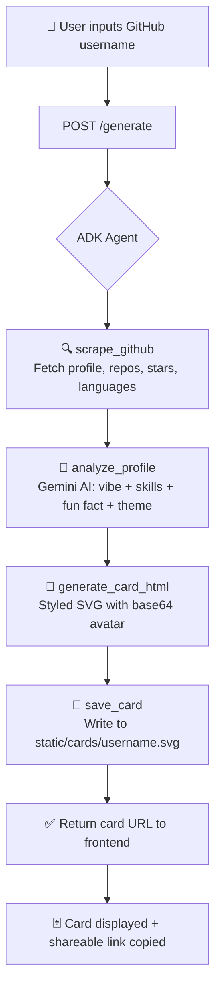

<div align="center">

# 🃏 GitHub Dev Card Generator


<br/>

[](https://python.org)
[](https://fastapi.tiangolo.com)
[](https://ai.google.dev)
[](https://reactjs.org)
[](https://docker.com)
[](LICENSE)
[](https://github.com/jlowin/fastmcp)
[](https://github-card-generator-979561348272.asia-south1.run.app/)

<br/>

> **Transform any GitHub profile into a stunning, AI-analyzed developer identity card — in seconds.**

<br/>

### 🌐 [Try the Live Demo →](https://github-card-generator-979561348272.asia-south1.run.app/)

<br/>

<!-- Add screenshot/demo GIF here -->
<!--  -->

[🚀 Quick Start](#-quick-start) · [📡 API Reference](#-api-reference) · [🎨 Themes](#-themes) · [🏗️ Architecture](#%EF%B8%8F-architecture) · [🤝 Contributing](#-contributing)

</div>

---

## ✨ Features

| Feature | Description |
|---|---|
| 🤖 **AI Profile Analysis** | Google Gemini 2.5 Flash analyzes personality, skills & vibe |
| 🎨 **5 SVG Themes** | `hacker` · `builder` · `researcher` · `designer` · `open-source-hero` |
| ⚡ **Async Pipeline** | Fully async with `httpx` — fast, non-blocking scrape-to-card flow |
| 🔌 **MCP-Compatible** | 4 tools exposed via Model Context Protocol (FastMCP) |
| 🐳 **Docker-Ready** | One `docker-compose up --build` and you're live |
| 📸 **Self-Contained SVG** | Base64-embedded avatars — zero external image dependencies |
| 🌐 **Cloud Run Ready** | `/health` endpoint included for GCP Cloud Run deployments |
| 🛡️ **Secure by Default** | API keys managed via `.env` — never hardcoded |
| 📱 **Responsive UI** | React 18 + Tailwind CSS with glassmorphism dark-theme frontend |

---

##  Demo


> 💡 **Try it yourself** — generate a card for `torvalds`, `gvanrossum`, or any GitHub username!

---

## 🏗️ Architecture

```
┌─────────────────────────────────────────────────────────┐
│                   Frontend (React 18)                   │
│              Port 3000 — Nginx / Docker                 │
│         Dark theme · Glassmorphism · Tailwind CSS       │
└───────────────────────────┬─────────────────────────────┘
                            │  POST /generate
                            ▼
┌─────────────────────────────────────────────────────────┐
│                  Backend (FastAPI)                      │
│                     Port 8080                           │
│                                                         │
│   ┌──────────────┐  ┌───────────────┐  ┌────────────┐   │
│   │scrape_github │  │analyze_profile│  │generate_   │   │
│   │              │  │               │  │card_html   │   │
│   │ GitHub REST  │  │  Gemini AI    │  │            │   │
│   │     API      │  │  2.5 Flash    │  │ 5 Themes   │   │
│   └──────┬───────┘  └───────┬───────┘  └─────┬──────┘   │
│          └──────────────────┴────────────────┘          │
│                             │                           │
│                    ┌────────▼────────┐                  │
│                    │   save_card     │                  │
│                    │  (SVG output)   │                  │
│                    └─────────────────┘                  │
│                                                         │
│   🔌 All 4 tools exposed via MCP (FastMCP)             │
│   🤖 Google ADK Agent orchestrates the pipeline        │
└─────────────────────────────────────────────────────────┘
```

### Flow Diagram



---

## 🚀 Quick Start

### Prerequisites

- Python 3.12+
- Docker & Docker Compose (for containerized setup)
- [GitHub Personal Access Token](https://github.com/settings/tokens) (optional but recommended)
- [Google Gemini API Key](https://aistudio.google.com/app/apikey)

---

### ⚙️ Local Development

```bash
# 1. Clone the repo
git clone https://github.com/Shub-ways/ADK-Google-Session-Project.git
cd ADK-Google-Session-Project/github-card-generator

# 2. Set up environment
cp .env.example .env
# Edit .env and add your API keys (see Environment Variables below)

# 3. Install dependencies
cd backend
pip install -r requirements.txt

# 4. Run the server
python main.py

# 5. Open in browser
# 🌐 http://localhost:8080
```

---

### 🐳 Docker (Recommended)

```bash
# 1. Clone and configure
git clone https://github.com/Shub-ways/ADK-Google-Session-Project.git
cd ADK-Google-Session-Project/github-card-generator

cp .env.example .env
# ✏️ Edit .env with your real API keys

# 2. Build and launch
docker-compose up --build

# Services:
# 🔵 Backend  → http://localhost:8080
# 🟢 Frontend → http://localhost:3000
```

> **Tip:** Use `docker-compose up --build -d` to run in detached mode.

---

### 🔐 Environment Variables

Create a `.env` file in `github-card-generator/`:

```env
# Required: Google Gemini API Key
GOOGLE_API_KEY=your_google_gemini_api_key_here

# Optional but recommended: Avoids GitHub rate limits (60 → 5000 req/hr)
GITHUB_TOKEN=your_github_personal_access_token_here
```

| Variable | Required | Description |
|---|---|---|
| `GOOGLE_API_KEY` | ✅ Yes | Google Gemini API key from [AI Studio](https://aistudio.google.com) |
| `GITHUB_TOKEN` | ⚡ Recommended | GitHub PAT — raises rate limit from 60 to 5,000 req/hr |

---

## 📡 API Reference

### Endpoints

| Method | Endpoint | Description |
|---|---|---|
| `GET` | `/` | Serves the React frontend UI |
| `GET` | `/health` | Health check (for Cloud Run / load balancers) |
| `POST` | `/generate` | **Generate a dev card** — see body below |
| `GET` | `/card/{username}` | Retrieve a previously generated SVG card |
| `GET` | `/static/cards/{username}.svg` | Direct SVG file access |

### `POST /generate`

**Request Body:**
```json
{
  "username": "torvalds"
}
```

**Response:**
```json
{
  "card_url": "/card/torvalds",
  "username": "torvalds",
  "theme": "open-source-hero",
  "developer_vibe": "The Legend of Open Source",
  "top_skills": ["C", "Linux Kernel", "Git"],
  "fun_fact": "Created Git in just 10 days to manage Linux kernel development"
}
```

**Example cURL:**
```bash
curl -X POST http://localhost:8080/generate \
  -H "Content-Type: application/json" \
  -d '{"username": "torvalds"}'
```

---

## 🔌 MCP Tools

Four tools exposed via **FastMCP** — usable by any MCP-compatible agent or host:

```
mcp_server.py
```

| Tool | Signature | Description |
|---|---|---|
| `scrape_github` | `(username: str)` | Fetches profile, repos, star count, top languages, avatar, bio via GitHub REST API |
| `analyze_profile` | `(username: str)` | Sends cached data to Gemini → returns `developer_vibe`, `top_skills`, `fun_fact`, `card_theme` |
| `generate_card_html` | `(username: str)` | Builds a fully-themed SVG card with embedded base64 avatar, skills badges, stats & AI insights |
| `save_card` | `(username: str, html: str)` | Persists the SVG to `static/cards/{username}.svg` |

### Google ADK Agent

```python
# agent.py
Agent(
    name="github_card_agent",
    model="gemini-2.5-flash",
    tools=[scrape_github, analyze_profile, generate_card_html, save_card],
    instruction="""
        Follow this strict 4-step pipeline:
        1. scrape_github(username)
        2. analyze_profile(username)
        3. generate_card_html(username)
        4. save_card(username, svg)
    """
)
```

---

## 🎨 Themes

Five hand-crafted color palettes, auto-assigned by Gemini based on the developer's profile:

| Theme | Preview | Background | Text Color | Assigned To |
|---|---|---|---|---|
| `hacker` | ⬛🟩 | `#000000` | `#00FF00` | Systems devs, CTF players |
| `builder` | 🟦🔵 | `#F0F7FF` | `#1E3A8A` | Full-stack, product builders |
| `researcher` | 🟣💜 | `#F5F3FF` | `#4C1D95` | ML engineers, academics |
| `designer` | 🩷🌸 | `#FDF2F8` | `#831843` | UI/UX, creative devs |
| `open-source-hero` | 🟠🤎 | `#FFF7ED` | `#7C2D12` | OSS contributors & maintainers |

---

## 📁 Project Structure

```
ADK-Google-Session-Project/
├── .gitignore
└── github-card-generator/
    ├── .env.example                  # 🔐 Environment variables template
    ├── docker-compose.yml            # 🐳 Docker orchestration
    │
    ├── backend/
    │   ├── Dockerfile                # Python 3.12-slim + uv
    │   ├── requirements.txt          # Python dependencies
    │   ├── main.py                   # 🚀 FastAPI app — endpoints & pipeline
    │   ├── agent.py                  # 🤖 Google ADK Agent (Gemini 2.5 Flash)
    │   ├── mcp_server.py             # 🔌 MCP tools: scrape, analyze, generate, save
    │   ├── check_models.py           # 🔍 Utility to list available Gemini models
    │   ├── test_mcp.py               # ✅ Tests for MCP tools
    │   ├── test_shub_ways.py         # 🧪 Integration test for specific user
    │   ├── frontend/
    │   │   └── index.html            # 🖼️ Embedded frontend served by backend
    │   └── static/
    │       └── cards/                # 🃏 Generated SVG cards stored here
    │           ├── Shub-ways.svg
    │           ├── arry-codes.svg
    │           └── torvalds.html
    │
    └── frontend/
        ├── Dockerfile                # Nginx Alpine + envsubst
        └── index.html                # ⚛️ Standalone React frontend
```

---

## 🛠️ Tech Stack

<table>
<tr>
<td><strong>Layer</strong></td>
<td><strong>Technology</strong></td>
<td><strong>Purpose</strong></td>
</tr>
<tr>
<td>Backend</td>
<td>Python 3.12, FastAPI, Uvicorn</td>
<td>REST API & async server</td>
</tr>
<tr>
<td>AI / LLM</td>
<td>Google Gemini 2.5 Flash</td>
<td>Profile analysis & theme selection</td>
</tr>
<tr>
<td>Agent Framework</td>
<td>Google ADK</td>
<td>Orchestrates the 4-step pipeline</td>
</tr>
<tr>
<td>MCP Server</td>
<td>FastMCP (mcp[fastmcp])</td>
<td>Exposes tools via Model Context Protocol</td>
</tr>
<tr>
<td>Frontend</td>
<td>React 18, Tailwind CSS, Babel</td>
<td>Browser-based UI</td>
</tr>
<tr>
<td>HTTP Client</td>
<td>httpx (async)</td>
<td>Non-blocking GitHub API calls</td>
</tr>
<tr>
<td>Container</td>
<td>Docker, Docker Compose</td>
<td>Reproducible builds & deployment</td>
</tr>
<tr>
<td>Frontend Server</td>
<td>Nginx (Alpine)</td>
<td>Serves React frontend in Docker</td>
</tr>
<tr>
<td>Config</td>
<td>python-dotenv</td>
<td>Environment variable management</td>
</tr>
</table>

---

## 🤝 Contributing

Contributions are what make the open-source community amazing. Any contributions are **greatly appreciated**!

```bash
# 1. Fork the repository
# 2. Create your feature branch
git checkout -b feature/amazing-new-theme

# 3. Commit your changes
git commit -m "feat: add cyberpunk theme 🟣"

# 4. Push to your branch
git push origin feature/amazing-new-theme

# 5. Open a Pull Request
```

**Ideas welcome:**
- 🎨 New card themes
- 📊 Additional GitHub stats (PRs, commits, issues)
- 🌍 i18n / multi-language support
- 🔗 Share-to-Twitter / LinkedIn integration
- 🧪 More test coverage

Please read [CONTRIBUTING.md](CONTRIBUTING.md) and follow the [Code of Conduct](CODE_OF_CONDUCT.md).

---

## 📄 License

Distributed under the **MIT License**. See [`LICENSE`](LICENSE) for more information.

```
MIT License — free to use, modify, and distribute with attribution.
```

---

<div align="center">

### Built with ❤️ by [Shub-ways](https://github.com/Shub-ways)

[](https://github.com/Shub-ways)

<br/>

**If this project helped you, please consider giving it a ⭐ — it means a lot!**

<br/>

*Powered by [Google Gemini](https://ai.google.dev) · Built with [FastAPI](https://fastapi.tiangolo.com) · Containerized with [Docker](https://docker.com)*

</div>
